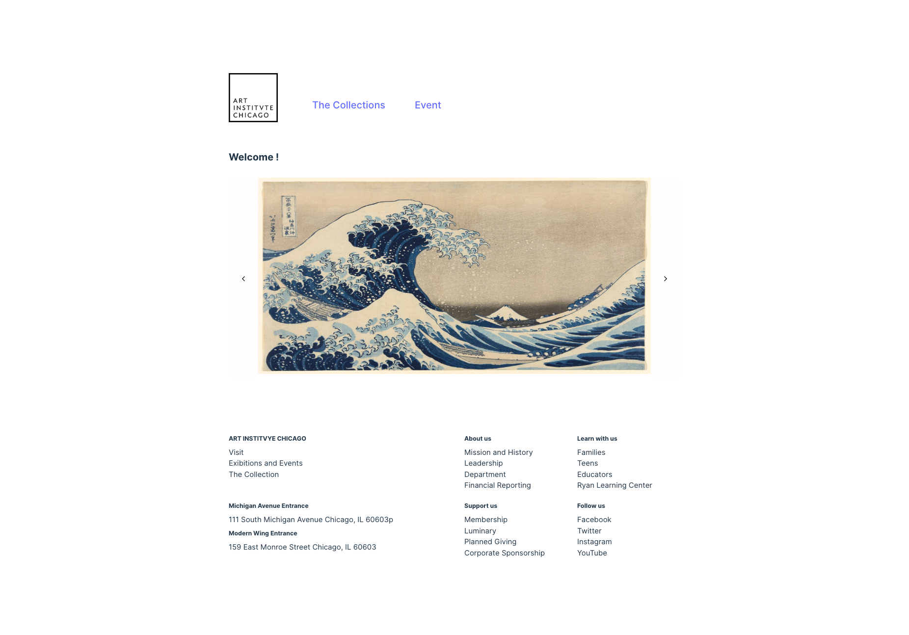
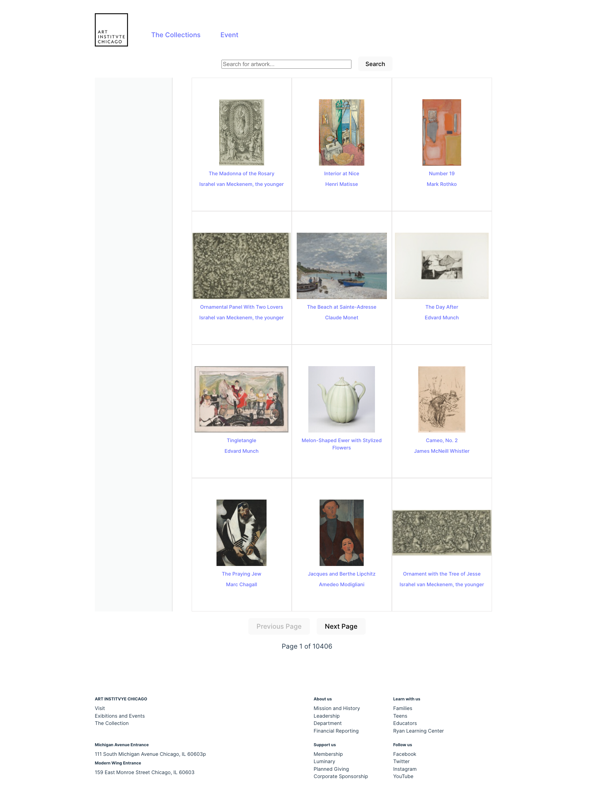
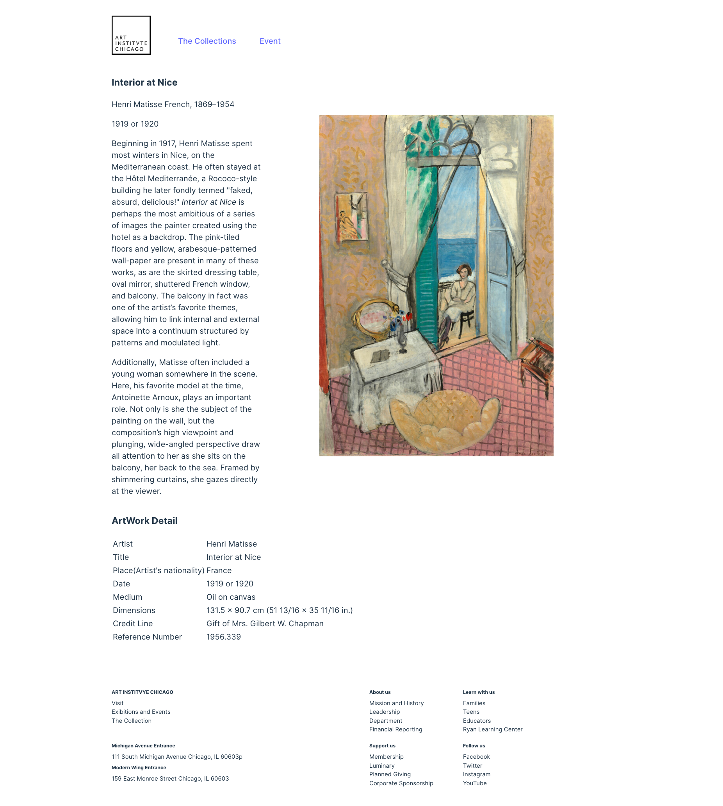
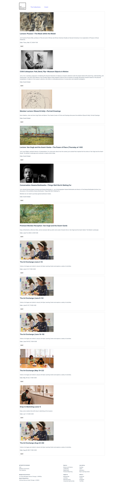

# Art Museum Project
Art Museum Project is a web application that allows users to search for artworks from a museum database and view details about each artwork.

## Table of Contents
  - [Table of Contents](#table-of-contents)
  - [Introduction](#introduction)
  - [Features](#features)
  - [Technologies](#technologies-used)
  - [Installation](#installation)
  - [Dependencies](#dependencies)
  - [Screenshots](#screenshots)

## Introduction
The Art Museum Project was created to provide art enthusiasts with an easy-to-use platform to explore artworks from a curated museum collection. Users can search for artworks by title, artist, or keyword, and view details such as the title, artist, date, and image of each artwork.

## API -- Art Institute of Chicago 
https://api.artic.edu/docs/#introduction

## Features

- Search for artworks by title, artist, or keyword
- View details about each artwork, including title, artist, date, and image
- Navigate to the detail page of each artwork for more information
- Responsive design for optimal viewing on different devices
## Technologies Used

- React.js
- React Router
- Axios
- CSS (for styling)

## Installation

1. Clone the repository: git clone <https://github.com/yhuuuu/Museum_React.git>

2. Install dependencies: npm install
``
npm install
``

3. Run the file
``
npm run dev
``

## Dependencies
- "axios": "^1.6.8",
- "react": "^18.2.0",
- "react-dom": "^18.2.0",
- "react-router-dom": "^6.22.3",
- "vite": "^5.1.6"

 

## Screenshots
### Home Page

 

### Artwork Page

 
### Artwork Detail Page

 ### Event Page

   
     
   
    